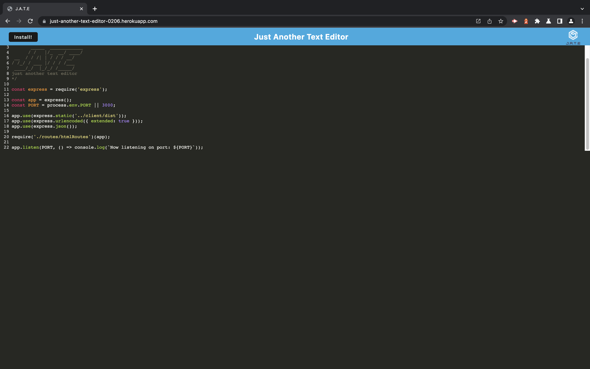
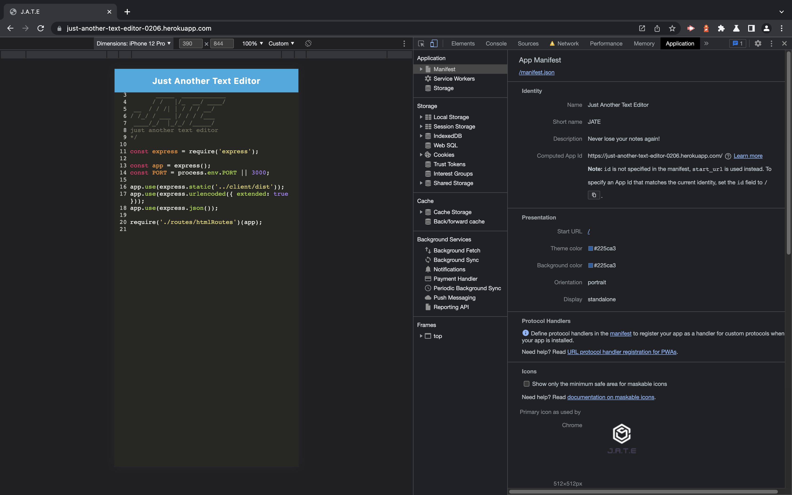
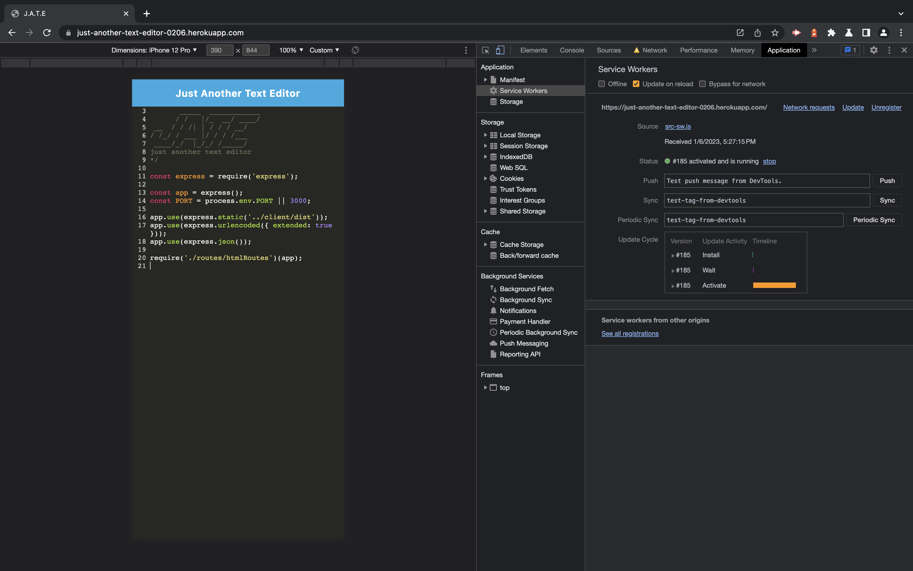
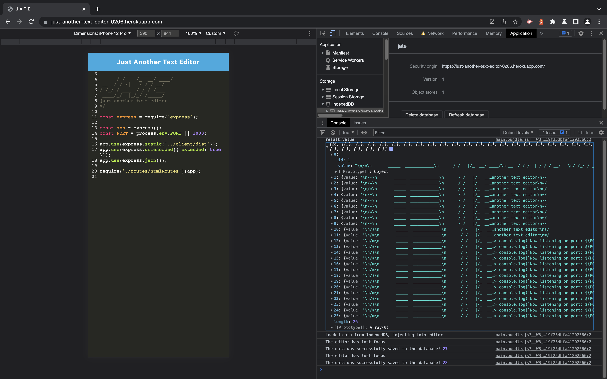
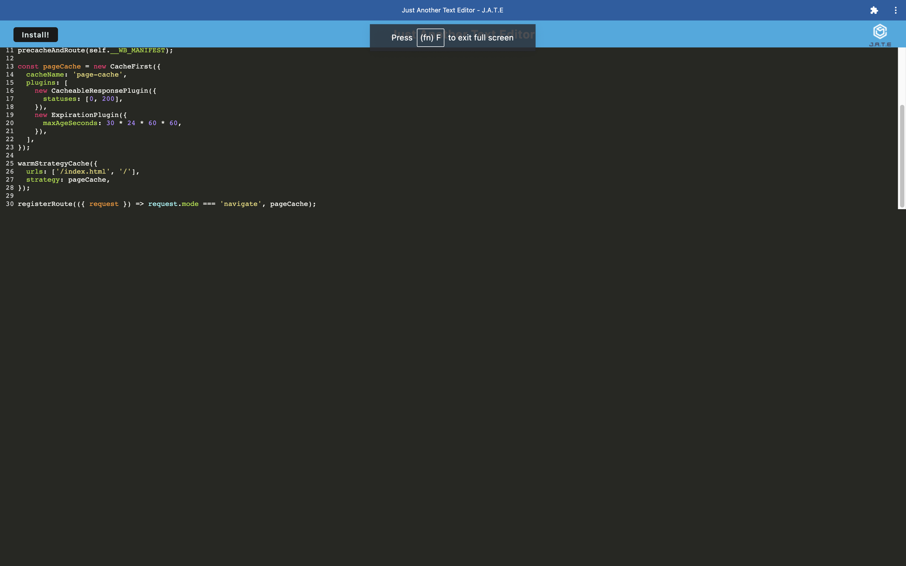

# Just Another Text Editor

 

## License

 

 

[This application is under the Unlicense](http://unlicense.org/)

 

## Deployment Link

 

[Deployment](https://just-another-text-editor-0206.herokuapp.com)

 

☝🏻 Click there!

 

## Table of Contents

 

- [Just Another Text Editor](#just-another-text-editor)
  - [License](#license)
  - [Deployment Link](#deployment-link)
  - [Table of Contents](#table-of-contents)
  - [Description](#description)
  - [Installation](#installation)
  - [Usage](#usage)
  - [Badges](#badges)
  - [Questions](#questions)
    - [GitHub](#github)
    - [Email](#email)

<small><i><a href='http://ecotrust-canada.github.io/markdown-toc/'>Table of contents generated with markdown-toc</a></i></small>

 

## Description

 

Just Another Text Editor (JATE) is a text editor that runs in the browser and functions offline. In addition, it's a Progressive Web Application that features a number of data persistence techniques. JATE gets and stores data to an IndexedDB database and was built using the frameworks, languages and libraries listed down below in the **Badges** section.

 

## Installation

 

Clone the repository to your local machine, open your terminal, and navigate to the root folder in the **Just Another Text Editor** repository. To install the necessary dependencies, run `npm i` in your command-line terminal. Repeat the process 2 more times, first navigating to `just-another-text-editor/client` and then navigating to `just-another-text-editor/server`. For offline functionality, head to `https://just-another-text-editor-0206.herokuapp.com`, press the **Install!** button in the upper-left corner and save it to your device!

 

## Usage

 

The following image demonstrates the application's functionality:

 

 

The following image shows the application's manifest.json file:

 

 

The following image shows the application's registered service worker:

 

 

The following image shows the application's IndexedDB storage:

 

 

The following image shows the application's offline functionality:

 

 

## Badges

 

 

 

 

 

 

 

 

 

 

 

 

 

 

 

## Questions

 

If you have any additional questions, you can reach me at:

 

### GitHub

 

 

[jesterb0206](https://www.github.com/jesterb0206)

 

### Email

 

 

jesterb@seattleu.edu
